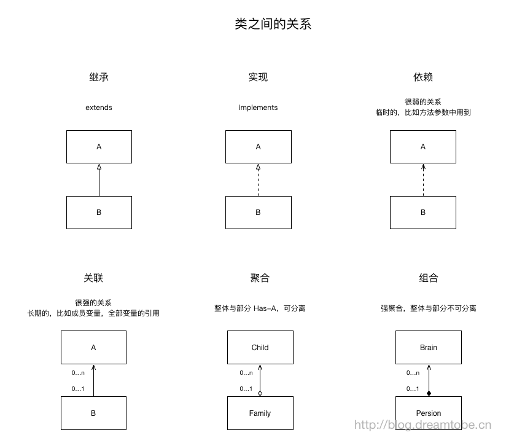

----
title: 类和类的关系 6种   
category: UML  
tag:
  - 基础
----

* 泛化关系/继承（generalization）  
    - 三角空心+实线，  
      - 指向`父类`
    - 表现为`继承非抽象类`
      -  如：小汽车-suv，is-a 
    
* 实现关系（realization）   
    - 三角空心+虚线，
      - 指向`接口`
    - 表现为`实现抽象类`
      -  如：车-小汽车（抽象类-子类）
* 依赖关系（dependency）    
    - 箭头+虚线   
        - 箭头指向`被调用者`，例如每个对象可以使用其特定的抽象功能对象，那么就指向这个抽象功能对象
    - 依赖关系体现为类构造方法及类方法的传入参数，箭头的指向为调用关系；依赖关系处理临时知道对方，临时使用而并持有对方，这叫做依赖关系  
      -  如：类构造方法及类方法的传入参数，同步变化，临时调用方法
    
* 关联关系－单向关联（Directed Association） 
    - 箭头+实线  例如A知道B而B不知道A，那么B就是A的关联对象，关联对象通常是以成员变量的形式实现的，持有对方  
    - 指向`被拥有者`
      -  如：试卷-（测试）-学员
      - 不同类的对象之间的结构关系，动词  
* 关联关系－双向关联（Association）
    - 实线    
    - `无指向`
      - 与单项关联不同的是：对象间相互知道 
* 聚合关系（Aggregation）   
    - 空心菱形+实线 聚合关系用于表示实体对象之间的关系，表示整体由部分构成的语义,整体没有了，但是部分还是存在的这叫做聚合  
    - `空心菱形`指向`整体`，`实线箭头`指向`部分`
      -  如：汽车和车轮
      - 类和成员变量，has a
    
* 组合关系（Composition） 
    - 实心菱形+实线  组合关系同样表示整体由部分构成的语义，但是它们是一种强依赖的特殊聚合关系，
      - `实心菱形`指向`整体`，`实线箭头`指向`成员变量`
    - 整体和部分是不可分割的，有共同的生命周期；
      - 身体和手，公司和部门，contains a
泛化 = 实现 > 组合 > 聚合 > 关联 > 依赖 

