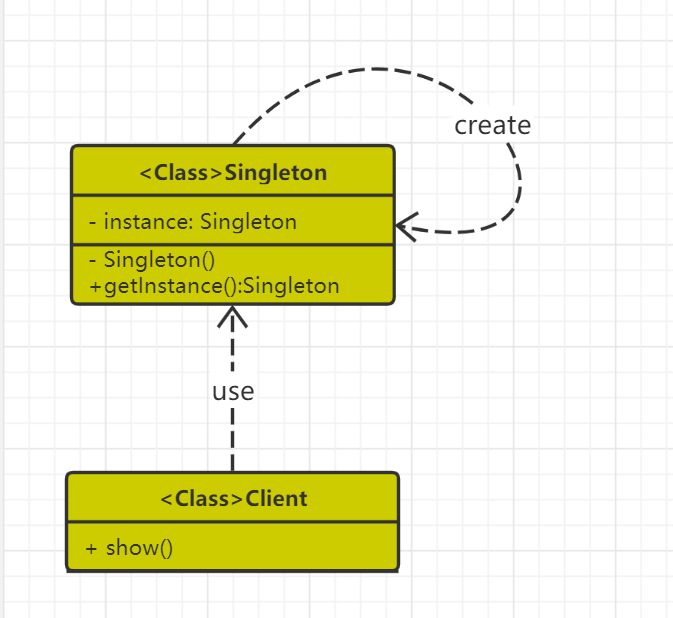

---  
title: 单例笔记  
category: 系统设计   
tag:  
  - 设计模式
    - 创建型
---

这种模式涉及到一个单一的类，该类负责创建自己的对象，同时确保只有单个对象被创建。这个类提供了一种访问其唯一的对象的方式，可以直接访问，不需要实例化该类的对象。
### 好处
1、某些类创建比较频繁，对于一些大型的对象，这是一笔很大的系统开销。
2、省去了new操作符，降低了系统内存的使用频率，减轻GC压力。
3、有些类如交易所的核心交易引擎，控制着交易流程，如果该类可以创建多个的话，系统完全乱了。（比如一个军队出现了多个司令员同时指挥，肯定会乱成一团），所以只有使用单例模式，才能保证核心交易服务器独立控制整个流程。


### 特点
- 1、只能有一个实例。
- 2、必须自己创建自己的唯一实例。
- 3、必须给所有其他对象提供这一实例。

## 代码与设计实现
### 类结构
- 使用一个私有构造函数、一个私有静态变量以及一个公有静态函数来实现。  


### 如何实现
- 私有构造函数保证了不能通过构造函数来创建对象实例，只能通过公有静态函数返回唯一的私有静态变量。
---
## 实现方法

- [饿汉式](/src/main/java/designPatternCode/singleton/Mgr01.java)
```java
private final static Singleton uniqueInstance = new Singleton();
```
   - 优点：线程安全
   - 缺点：不管用到与否，类装载时就完成实例化
   - 关键：
     - 私有化构造方法
     - 公共静态方法
     - static final得创建实例
- [懒汉式](/src/main/java/designPatternCode/singleton/Mgr03.java)
```java
if (INSTANCE == null) {INSTANCE = new Mgr03();}
```
   - 优点：延迟加载，用到时才加载
   - 缺点：线程不安全
   - 关键：
     - 私有化构造方法
     - 公共静态方法
     - 实例若为空就创建实例
     
- [懒汉式-线程安全](/src/main/java/designPatternCode/singleton/Mgr04.java)
  - 关键：懒汉式基础上，对getInstance加synchronized关键字
  - 优点：解决线程安全性
  - 缺点：性能慢，串行，不建议食用    
注：线程问题发生条件  
1.多线程的环境下  
2.必须有共享资源  
3.对资源进行非原子性操作  

- [懒汉式-双层判断](/src/main/java/designPatternCode/singleton/Mgr06.java)
  - 关键：懒汉式基础上，对涉及多线程的同步代码块加synchronized关键字，且块内再次判断
  - 优点：解决线程安全性
  - 缺点：写法复杂，需要同步代码块内外都判断，不建议食用    

- [懒汉式-静态内部类方式](/src/main/java/designPatternCode/singleton/Mgr07.java)
  - 关键：当 Singleton 类被加载时，静态内部类 SingletonHolder 没有被加载进内存。  
        只有当调用 `getUniqueInstance()` 方法从而触发 `SingletonHolder.INSTANCE` 时 SingletonHolder 才会被加载，此时初始化 INSTANCE 实例，  
        并且 JVM 能确保 INSTANCE 只被实例化一次  
  - 优点：懒加载，线程安全
  - 缺点：若构造函数内出错，则不会产生实例
  
- [懒汉式-枚举](/src/main/java/designPatternCode/singleton/Mgr08.java)
  - 关键：当 Singleton 类被加载时，静态内部类 SingletonHolder 没有被加载进内存。  
        只有当调用 `getUniqueInstance()` 方法从而触发 `SingletonHolder.INSTANCE` 时 SingletonHolder 才会被加载，此时初始化 INSTANCE 实例，  
        并且 JVM 能确保 INSTANCE 只被实例化一次  
  - 优点：懒加载，线程安全，防止反序列化，effective java推荐方式
  - 缺点：无
  
- 工作中常用方法：
  - 使用spring的bean工厂产生单例